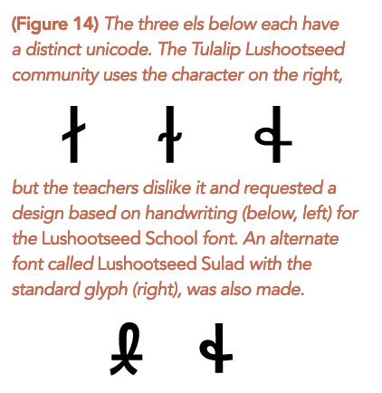

## COAST

UBC reference (includes semi-unicode font) [https://fnel.arts.ubc.ca/resources/font/](https://fnel.arts.ubc.ca/resources/font/)

#### Comox / Sliammon / Klahoose
`a æ aw ay ɔ č č̓ e ɛ ə əw əy g gʸ h i ɩ ǰ k k̓ kʷ k̓ʷ kʸ k̓ʸ l l̓ ɬ ƛ ƛ̓ m m̓ n n̓ o ɔy p p̓ q q̓ qʷ q̓ʷ s š t t̓ θ tᶿ t̓ᶿ u ʊ w w̓ χ χʷ xʷ y y̓ ʔ `

###### References:
* [http://www.firstvoices.com/en/Sliammon/welcome]([http://www.firstvoices.com/en/Sliammon/welcome)
* [http://www.firstvoices.com/en/Klahoose/welcome](http://www.firstvoices.com/en/Klahoose/welcome)

#### Pentlach 
`EXTINCT`

#### Sechelt
`a ch ch̕ e h i k k̕ kw kw̕ ḵ ḵ̕ ḵw ḵw̕ l lh m n p p̕ s sh t t̕ tl̕ ts ts̕ u w x xw x̱ x̱w y ˀ ʔ `

###### References:
* [http://www.firstvoices.com/en/she-shashishalhem/welcome](http://www.firstvoices.com/en/she-shashishalhem/welcome)

#### Squamish
`7 a ao e h i k ḵ k' kw k̓w ḵw ḵwʼ l l' lh m m̓ n n̓ p p̓ s sh t t’ ts ts̓ u x̱ xw y y̓ z z̓ á é í ú`

###### References:
* [https://en.wikipedia.org/wiki/Squamish_language](https://en.wikipedia.org/wiki/Squamish_language)

#### Hul'q’umi'num / Halkomelem
`' a aa ch ch' e ee h hw i ii k kw kw' l lh m n o oo ou p p' q q' qw qw' s sh t t' th tl' ts ts' tth tth' u w x xw y `

###### References:
* [https://www.firstvoices.com/explore/FV/sections/Data/Coast%20Salish/Halkomelem/Stz%E2%80%99uminus/learn/alphabet](https://www.firstvoices.com/explore/FV/sections/Data/Coast%20Salish/Halkomelem/Stz%E2%80%99uminus/learn/alphabet)
* [https://www.firstvoices.com/explore/FV/sections/Data/Coast%20Salish/Halkomelem/HUL%27Q%27UMI%27NUM%27](https://www.firstvoices.com/explore/FV/sections/Data/Coast%20Salish/Halkomelem/HUL%27Q%27UMI%27NUM%27)
* [https://native-land.ca/maps/languages/hulquminum-halqemeylem-h%C9%99n%CC%93q%CC%93%C9%99min%CC%93%C9%99m%CC%93/](https://native-land.ca/maps/languages/hulquminum-halqemeylem-h%C9%99n%CC%93q%CC%93%C9%99min%CC%93%C9%99m%CC%93/)

#### Hən̓q̓əmin̓əm̓
`c c̓ č h k kʷ k̓ʷ l l̓ ƛ̓ ɬ m m̓ n n̓ p p̓ q q̓ qʷ q̓ʷ s š t t̓ t̓ᶿ θ w w̓ x xʷ χ χʷ y y̓ ʔ a a: e e: i i: u u: ǝ ay ey ey̓ ǝy ǝy̓ aw̓ a:w̓ ew iw iw̓ ǝw ǝw̓`

###### References:
* [http://www2.moa.ubc.ca/musqueamteachingkit/alphabet.php](http://www2.moa.ubc.ca/musqueamteachingkit/alphabet.php)

Drawn samples of each letter. Note that the commaabove is tucked in tight to the ascending letters. To enable this kind of behavior, it would make sense to substitute commaabove by commaaboveright in order to position with the top_right anchor instead.

* [http://tsawwassenfirstnation.com/event/hən̓q̓əmin̓əm̓-language-class-adults/](http://tsawwassenfirstnation.com/event/hən̓q̓əmin̓əm̓-language-class-adults/)
* [http://musqueam.zenutech.com/language](http://musqueam.zenutech.com/language)
* [https://www.kwikwetlem.com/pronunciation-guide.htm](https://www.kwikwetlem.com/pronunciation-guide.htm)

#### Halq'eméylem
`í é á ú ó ō m ch ch' p p' ' k k' kw kw' y w q q' qw qw' t t' ts ts' th th' tl' l h lh s sh shxw x x̱ xw x̱w ey é:y iy oy ōy uy ew iw ow ōw úw áy áw `

###### References:
* [https://www.firstvoices.com/explore/FV/sections/Data/Salish/Halkomelem/Halq'em%C3%A9ylem/learn/alphabet](https://www.firstvoices.com/explore/FV/sections/Data/Salish/Halkomelem/Halq'em%C3%A9ylem/learn/alphabet)
* [https://www.stolonation.bc.ca/shxweli-language](https://www.stolonation.bc.ca/shxweli-language)
* [http://www.coqualeetza.com](http://www.coqualeetza.com)

#### Nooksack
`a qw ch qw' ch' s e sh h t i t' k ts kw ts' kw' tl' l u lh w lh' x m xw n x̱ o x̱w p y p' y' q ʔ q' á í é ó ú ː `

###### References:
* [https://en.wikipedia.org/wiki/Nooksack_language](https://en.wikipedia.org/wiki/Nooksack_language)
* [https://nooksacktribe.org/departments/cultural-resources/](https://nooksacktribe.org/departments/cultural-resources/)

#### Squamish
`a ao e i u aw ay ew ey iw iy uw uy ch ch’ h k kw k’ k̓w ḵ ḵ’ ḵw ḵw’ l lʼ lh m m̓ n n̓ p p̓ s sh t t’ tl’ ts ts’ w w̓ xw x̱ x̱w y y̓ 7`

###### References:
* [https://en.wikipedia.org/wiki/Squamish_language](https://en.wikipedia.org/wiki/Squamish_language)
* [https://www.kwiawtstelmexw.com/language_resources/how-to-read-the-squamish-language/](https://www.kwiawtstelmexw.com/language_resources/how-to-read-the-squamish-language/)

The `kwiawtstelmexw` website is a bit confusing as it indicates that both apostrophe and glottalized consonants (commaaboveright) are used, but they seem to be used for the same purpose. Probably best to support both (but many other Salishan languages also need the commaaboveright form) over `hkwlmnptswy`. 

#### Straights Salish (Saanich)
`A Á Ⱥ B C Ć Ȼ D E H I Í J K ₭ Ḵ Ḱ L Ƚ M N Ṉ O P Q S Ś T Ⱦ Ŧ Ṯ U W W̱ X X̱ Y Z s , ¸`

###### Note per Timothy Montler:
In handwritten material and in much typed material, the glottal stop is written as a comma. In situations where the comma (,) is a punctuation mark, the cedilla character (¸) is the glottal stop.

A font that supports Saanich should include both `, ¸` for various typesetting options. 

###### References:
* [http://saanich.montler.net/say/index.htm](http://saanich.montler.net/say/index.htm)
* [https://en.wikipedia.org/wiki/Saanich_dialect](https://en.wikipedia.org/wiki/Saanich_dialect)
* [https://sencoten.org/](https://sencoten.org/)
* [https://www.sd63.bc.ca/programs-and-services/indigenous-education](https://www.sd63.bc.ca/programs-and-services/indigenous-education)

#### Lummi
`MISSING`

#### Samish
`a ch ch' e h i k kw kw' l lh m n ng o p p' q q' qw qw' s sh t t' tl' ts ts' u w x̲ xw x̲w y á é í ó ú`

Accented vowels indicate glottal stop

###### References:
* [https://classroom.samishtribe.nsn.us/mod/book/view.php?id=163](https://classroom.samishtribe.nsn.us/mod/book/view.php?id=163)

#### Lushootseed
`ʔ a b c c̓ č č̓ d dᶻ ə g gʷ h i ii ǰ k k̓ kʷ k̓ʷ l l̓ ɬ ɫ ł ƛ̓ m m̓ n n̓ p p̓ q q̓ qʷ q̓ʷ s š t t̓ u w w̓ xʷ x̌ x̌ʷ y y̓ ⋯ ·`

- ⋯ or · used to mark an elongated sound / emphasis
- Depending on the tribe there appear to be three variants in use for the lateral fricative: ɬ ɫ ł. May be best to support all three.

From [Juliet Shen's article on the design of her Lushootseed font](https://github.com/aaronbell/Salishan/blob/master/references/indigenous-type.pdf)

###### Note:
When used, stress can be indicated on vowels using the acute and grave accents. However, no tribal website indicates use of these accented forms in their orthographies and, they can (likely) be safely ignored for practical orthography applications. 

###### References:
* [https://tulaliplushootseed.com/alphabet/](https://tulaliplushootseed.com/alphabet/)
* [https://www.puyalluptriballanguage.org/basics/alphabet.php (uses ł)](https://www.puyalluptriballanguage.org/basics/alphabet.php)
* [http://www.native-languages.org/lushootseed_guide.htm](http://www.native-languages.org/lushootseed_guide.htm)
* [https://lushootseedblog.wordpress.com/linguistic-patterns/](https://lushootseedblog.wordpress.com/linguistic-patterns/)
* [https://readings.design/PDF/indigenous-type.pdf](https://readings.design/PDF/indigenous-type.pdf)

#### Twana
`MISSING`

###### References:
* [http://www.skokomish.org/cultural-resources/](http://www.skokomish.org/cultural-resources/)

#### Quileute
`a b ch c̓h d h i k k̓ kʷ k̓ʷ ḳ k̓ ḳʷ k̓ʷ l ł ɫ o p p̓ s sh t t̓ tł t̓ł ts t̓s w x xʷ x̣ x̣ʷ y ʔ a̱ g ·`

###### Notes:
- Stress can be indicated with acute and grave. Per the non-unicode font available on the Quileute Nation webpage, these can be added to the `a a̱ o i`
- The center dot is used to indicate vowel length
- Both ł ɫ are included in the non-unicode font, and website seems to indicate that either is viable
- Like with other languages, the expectation appears to be that the commaabove is centered on lowercase, but offset on ascending letters.

###### References:
* [https://quileutenation.org/wp-content/uploads/2017/01/QuileuteAlphabetSheet.pdf](https://quileutenation.org/wp-content/uploads/2017/01/QuileuteAlphabetSheet.pdf) (handwritten forms)
* [https://quileutenation.org/language/](https://quileutenation.org/language/)

#### S’Klallam
`ʔ a c c̕ č č̕ e ə h i k kʷ k̕ʷ l ɬ ƛ̕ m m̕ n n̕ ŋ ŋ̕ p p̕ q q̕ qʷ q̕ʷ s š t t̕ u w w̕ xʷ x̣ x̣ʷ y y̕ á é í ú ə́ ˑ`

###### References:
* [https://www.elwha.org/culture-history/klallam-language/](https://www.elwha.org/culture-history/klallam-language/)
* [http://www.klallam.montler.net/Klalphabet.htm](http://www.klallam.montler.net/Klalphabet.htm)

#### Quinault
`ʔ a c c̓ č č̕ ə e g g̣ h ɪ i j k k̓ ḳ ḳ̓ l l̓ ɫ ƛ̕ m n o p p̕ s š t t̕ u w W x̣ y`

###### Notes:
* the site below shows a small /I form for the image with the bear. It is unclear what the correct Unicode glyph is for this. At this time, I've used ɪ. 

###### References:
* [http://www.u.arizona.edu/~cosettelsmith/quinault%20language.html](http://www.u.arizona.edu/~cosettelsmith/quinault%20language.html)

#### Upper Chehalis
`MISSING`

#### Lower Chehalis
`MISSING`

#### Cowlitz
`MISSING`

#### Haida - 
`b c x d dl g G r ĝ ǥ gh h hl j k k’ kk q ḵ q q’ ḵ’ qq l l ll m m mm n n nn ng p p' r ǥ gh s t t’ tt tl tl’ ttl ts (ch) ts’ tts w x x̱ X x x̂ x̱ xh y 7 ’ ' i ii u uu e ee o oo a aa · .`

`ä . a aa b ch d dl ei g G ç r ɢ̱ ĝ h hl i íi j k k’ ḵ q ñ ḵ’ q’ ñ’ l ’l m n ng p p’ s t t’ tl tl’ ts ts’ ú uu w ’w x c x ý x x̂ þ y ya’

###### Notes:
- There are many different orthographies for the various Haida dialects. This covers Enrico Masset, Enrico Skidegate, Alaska Native Language Center, Skidegate Haida Immersion Program, and Bringhurst. As well as whichever [this](https://haidalanguage.blogspot.com/p/haida-alphabet.html) is. 
- Examples use either the ' or ’
- It appears that acutes accents can be used for indicating stress on vowels. 
- `ï ë ä` are used for nonsense syllables in songs (Enrico & Stuart, 1996)

###### References:
* [https://haidalanguage.blogspot.com/p/books.html](https://haidalanguage.blogspot.com/p/books.html)
* [https://en.wikipedia.org/wiki/Haida_language](https://en.wikipedia.org/wiki/Haida_language)
* [http://www.haidalanguage.org/ways-of-writing.html](http://www.haidalanguage.org/ways-of-writing.html)

#### Bella Coola
`a x xʷ h i k k̓ kʷ k̓ʷ l ł m n p p̓ q q̓ qʷ q̓ʷ s t t̓ ƛ ƛ̓ c c̓ u w x̣ x̣ʷ y ʔ `
`a c cw h i k k' kw kw' l lh m n p p' q q' qw qw' s t t' tl tl' ts ts' u w x xw y 7`

###### Notes:
Above are two different orthographies, Americanist and Practical. 

###### References:
* [https://www.firstvoices.com/explore/FV/sections/Data/Salish/Nuxalk/Nuxalk/learn/alphabet/print](https://www.firstvoices.com/explore/FV/sections/Data/Salish/Nuxalk/Nuxalk/learn/alphabet/print)
* [https://en.wikipedia.org/wiki/Nuxalk_language](https://en.wikipedia.org/wiki/Nuxalk_language)

#### Diidiitidq (Hul’q’umi’num’ area)
`a aa b b̓ c c̓ č čʼ d d̓ e ee h i ii k kʷ k̕ k̕ʷ l l̓ ł ƛ ƛ̕ m m̓ n n̓ o oo p p̓ q qʷ q̓ q̓ʷ s š t t̕ u uu w w̓ x xʷ x̣ x̣ʷ y y̓ ʔ ʕ `

###### References:
* [http://www.firstvoices.com/en/diidiitidq/welcome](http://www.firstvoices.com/en/diidiitidq/welcome)

#### Cisaaath (Hul’q’umi’num’ area)
`a aa c c̕ č č’ h ḥ i ii k k̕ kʷ k̕ʷ ł ƛ ƛ̕ m m̓ n n̓ p p̓ q qʷ s š t t̕ u uu w w̓ x x̣ xʷ x̣ʷ y y̓ ʕ ʔ e ee oo `

###### References:
* [http://www.firstvoices.com/en/cisaaath/welcome](http://www.firstvoices.com/en/cisaaath/welcome)
* [https://toquahtlanguage.com](https://toquahtlanguage.com)

#### Nuu-chah-nulth (Island Comox area)
`a ʔa ʕa aa ʔaa ʕaa e ʔe ʕe ee ʔee ʕee c c̕ č č’ h ḥ i ʔi ʕi ii ʔii ʕii k k̕ kʷ k̕ʷ ł ƛ ƛ̕ m m̕ n n̕ p p̕ q qʷ s š t t̕ u ʔu ʕu uu ʔuu ʕuu w w̕ x x̣ xʷ x̣ʷ y y̕ ʕ ʔ `

###### References:
* [http://www.firstvoices.com/en/Nuu-chah-nulth/welcome](http://www.firstvoices.com/en/Nuu-chah-nulth/welcome)
* [https://toquahtlanguage.com](https://toquahtlanguage.com)

#### Ehattesaht Nuchatlaht (Island Comox area)
`a aa c c̓ č č̓ h ḥ i ii k k̓ kʷ k̓ʷ ł ƛ ƛ̓ m m̓ n n̓ p p̓ q qʷ s š t t̓ u uu w w̓ x x̣ xʷ x̣ʷ y y̓ ʕ ʔ e ee o oo `

###### References:
* [http://www.firstvoices.com/en/Ehattesaht-Nuchatlaht/welcome](http://www.firstvoices.com/en/Ehattesaht-Nuchatlaht/welcome)

#### Kwak’wala
`a a̱ b d ḏ dł dz e g gw ǥ ǥw h i k kw k̓ k̕w ḵ ḵw ḵ̓ ḵ̕w l ł m n o p p̓ s t t̕ ts t̕s tł t̕ł u w x xw x̱ x̱w y ' `

###### References:
* [http://www.firstvoices.com/en/Kwakwala/welcome](http://www.firstvoices.com/en/Kwakwala/welcome)

#### Qʷi·qʷi·diččaq (Makah)
`ŋ ḥ m n p t c ƛ č k kʷ q qʷ ʔ p̓ t̓ c̓ ƛ̓ č̓ k̓ k̓ʷ q̓ q̓ʷ b d s ł ɫ š x xʷ x̌ x̌ʷ l y w a e i o u a· e· i· o· u· ay oy ey iy aw uy °`

###### Notes:
- The UW website below uses a different orthography than elsewhere. For the above, I've followed what appears to be the most practical orthography
- Wikipedia lists ł whereas the Makah Museum lists ɫ
- Makah Museum lists 4 letters as "Occasional Letters": `ŋ ḥ m n` 
- Another symbol that appear necessary: ° (signal marker)

###### References:
* [https://makahmuseum.com/departments/makah-language-program/](https://makahmuseum.com/departments/makah-language-program/)
* [https://content.lib.washington.edu/cmpweb/exhibits/makah/symbols-sounds.html](https://content.lib.washington.edu/cmpweb/exhibits/makah/symbols-sounds.html)
* [https://content.lib.washington.edu/cmpweb/exhibits/makah/whaling-in-makah.html](https://content.lib.washington.edu/cmpweb/exhibits/makah/whaling-in-makah.html)
* [https://en.wikipedia.org/wiki/Makah_language](https://en.wikipedia.org/wiki/Makah_language)

## INTERIOR
#### Shuswap
`a á c cw e é g gw g̓w h i í k kw k̕ k̕w l ĺ ll m m̓ n n̓ o ó p p̓ q qw q̓ q̓w r r̓ s t ts ts' t̕ u ú w w̓ x xw y y̓ 7 `

###### References:
* [https://www.firstvoices.com/explore/FV/sections/Data/Secwepemc/Secwepemctsin/Secwepemc/learn/](https://www.firstvoices.com/explore/FV/sections/Data/Secwepemc/Secwepemctsin/Secwepemc/learn/)
* [https://libguides.tru.ca/secwepemctsin](https://libguides.tru.ca/secwepemctsin)
* [https://secwepemcstrong.com/secwepemc-governance-4-pillars-overview/secwepemcstin/](https://secwepemcstrong.com/secwepemc-governance-4-pillars-overview/secwepemcstin/)

#### Lillooet
(Líl̓wat)
`a á e é i í o ó ii u ú ao aó v v́ p t ts k kw s z l m n w y h c cw lh q qw x xw g gw r 7 p̓ t̓ ts̓ k̓ k̓w q̓ q̓w z̓ ľ m̓ n̓ w̓ y̓ r̕ g̓ g̓w l̲ s̲ t̲s̲`

(Northern St̓át̓imcets) 
`a á e é i í o ii íi u ú ao áo v v́ p t ts k kw s s̲ z l m n w y h c cw lh q qw xw g gw r 7 p̓ t̓ ts̓ k̓ k̓w q̓ q̓w z̓ l̓ m̓ n̓ w̓ y̓ r̓ g̓ g̓w`

There is a third orthography below used by the Líl̓wat, but it appears to be discontinued in favor of the one above.
`p t c c̣ k kʷ q qʷ ʔ p’ c’ ƛ’ k’ k’ʷ q’ q’ʷ s ṣ ɬ x xʷ x̌ x̌ʷ h m n z l ḷ y ɣ w ʕ ʕʷ m’ n’ z’ l’ ḷ’ y’ ɣ’ w’ ʕ’ ʕ’ʷ i ị u ụ ǝ ǝ̣ a ạ á ạ́ ǝ́ ǝ̣́ í ị́ ú ụ́`

###### References:
* [http://www.firstvoices.com/en/Lilwat/welcome](http://www.firstvoices.com/en/Lilwat/welcome)
* [https://www.firstvoices.com/explore/FV/sections/Data/Interior%20Salish/Northern%20St%CC%95%C3%A1t%CC%95imcets/Northern%20St%CC%93%C3%A1t%CC%93imcets](https://www.firstvoices.com/explore/FV/sections/Data/Interior%20Salish/Northern%20St%CC%95%C3%A1t%CC%95imcets/Northern%20St%CC%93%C3%A1t%CC%93imcets)

#### Thompson River Salish
`ʔ a á c c̓ c̣ e é ə ə́ ə̣ ɣ ɣ̓ h i í ị k k̓ kʷ k̓ʷ l ḷ Ì ł ƛ̓ m m̓ n n̓ ó p p̓ q q̓ qʷ q̓ʷ s ṣ t t̓ Ɵ u ú w w̓ x xʷ x̣ x̣ʷ y y̓ z z̓ ʕ ʕ̓ ʕʷ ʕ̓ʷ l̓ l̕`

###### Notes:
Languagegeeks indicates a second orthography in use, but I cannot find any other examples of it. Leaving here for reference:
`p t ts tss k kw ḵ ḵw 7 p’ t’ ts’ tl’ k’ kw’ ḵ’ ḵw’ s ss lh x xw x̱ x̱w h m n z l y g w g̱ g̱w m̓ n̓ z̓ l̕ y̓ g̓ w̓ g̱̓ g̱̓w `

###### References:
* [https://www.firstvoices.com/explore/FV/sections/Data/scw%CC%93exmxc%C3%8Cn/n%C5%82e%CA%94kepmxcin/n%C5%82e%CA%94kepmxcin/learn/alphabet](https://www.firstvoices.com/explore/FV/sections/Data/scw%CC%93exmxc%C3%8Cn/n%C5%82e%CA%94kepmxcin/n%C5%82e%CA%94kepmxcin/learn/alphabet)
* [http://www.languagegeek.com/salishan/nlekepmxcin.html](http://www.languagegeek.com/salishan/nlekepmxcin.html)

#### Coeur d’Alene
`ɑ e ɑ̈ ê I i o ɔ u ə E ι ụ p pʼ b m mʼ ʼm w wʼ ʼw t tʼ d n nʼ ʼn s c ts ts cʼ tsʼ ts’ š sh c ǰ j dj č ch tc čʼ ch’ tc’ y yʼ ʼy ɡʷ ɡw ɡu kʷ kw k ku ko kʼʷ kʼw kʼu kʼo kʼụ xʷ khw khu kho xʷ xu q q’ qʷ qw qu qo qʼʷ q’w qʼu qʼo qʼʷ qʼu qh x̣ x̣ʷ qhw qhu qho l lʼ ʼl ɬ ł r rʼ ʼr ʕ ( ) R ʕʼ ʼ( ʼ) Rʼ ʕʷ (w (u rʷ ʕʼʷ ʼ(w uʼ( ṛʼʷ ʔ ʼ h`

###### Notes:
The above contains three different orthographies – Salishan / Linguistic phonetic orthography, Nicodemus/Bitar (Lawrence Nicodemus) and Reichard (Gladys Reichard).

###### References:
* [https://en.wikipedia.org/wiki/Coeur_d%27Alene_language](https://en.wikipedia.org/wiki/Coeur_d%27Alene_language)
* [http://ivydoak.com/Coeurd'Alene/ReichardTexts.htm](http://ivydoak.com/Coeurd'Alene/ReichardTexts.htm)

#### Columbia-Moses 
`a aa c c̓ č ə əə h ḥ ḥʷ i k k̓ kʷ k̓ʷ l l̕ ll ll̕ ł ɬ ƛ̓ m m̓ n n̓ p p̓ q q̓ qʷ q̓ʷ r r̓ š s t t̕ u uu w w̓ x xʷ x̌ x̌ʷ y y̓ ʔ ʕ ʕ̕ ʕʷ ʕ̕ʷ ‿`

###### References:
* [https://www.cct-lan.com/phonetic-alphabet-1](https://www.cct-lan.com/phonetic-alphabet-1)

#### Colville-Okanagan (n̓səl̓xcin̓ / Nsyilxcən)
`a c c̓ ə h i k k̓ kʷ k̓ʷ l l̓ ł ƛ̓ m m̓ n n̓ p p̓ q q̓ qʷ q̓ʷ r s t t̓ u w w̓ x x̌ xʷ x̌ʷ y y̓ ʕ ʕ̓ ʕʷ ʔ i a u ə o ‿`

`p t k s h m m̕ n l r w y c kʷ q qʷ ɬ x xʷ x̌ x̌ʷ p̕ t̕ c̕ k̕ k̕ʷ q̕ q̕ʷ ƛ̕ l̕ n̕ r̕ w̕ y̕ a ɣ i ə ʔ ʕ ʕ̕`

###### Notes:
Two similar orthographies appear to be in use. 

###### References:
* [https://www.firstvoices.com/explore/FV/sections/Data/nsyilxcən/nsyilxcən/Syilx/learn/alphabet](https://www.firstvoices.com/explore/FV/sections/Data/nsyilxcən/nsyilxcən/Syilx/learn/alphabet)
* [https://www.syilx.org/about-us/syilx-nation/nsyilxen-language/](https://www.syilx.org/about-us/syilx-nation/nsyilxen-language/)
* [http://www.thelanguagehouse.ca](http://www.thelanguagehouse.ca)
* [https://en.wikipedia.org/wiki/Okanagan_language](https://en.wikipedia.org/wiki/Okanagan_language)

#### Montana Salish - https://en.wikipedia.org/wiki/Salish-Spokane-Kalispel_language
`MISSING`

###### References:
* [https://sites.google.com/site/salishlanguage/](https://sites.google.com/site/salishlanguage/)
* [https://www.nkwusm.com/beginnings](https://www.nkwusm.com/beginnings)

#### Chinook Jargon - http://www.sacred-texts.com/nam/nw/chinook/cht03.htm
`a ch c’h ə h i k kʰ kw kʰw k’ k’w l ɬ m n p pʰ p’ q qʰ qw qʰw q’ q’w s sh t tʰ t’ tɬ t’ɬ ts t’s u w x xw x̣ x̣w y ʔ `

###### Notes:
There are various orthographies for Chinook Jargon, most of which use standard Latin letterforms. However, the Grand Ronde dialect uses a different set, listed above. 

###### References:
* [https://en.wikipedia.org/wiki/Chinook_Jargon#Orthographies](https://en.wikipedia.org/wiki/Chinook_Jargon#Orthographies)
